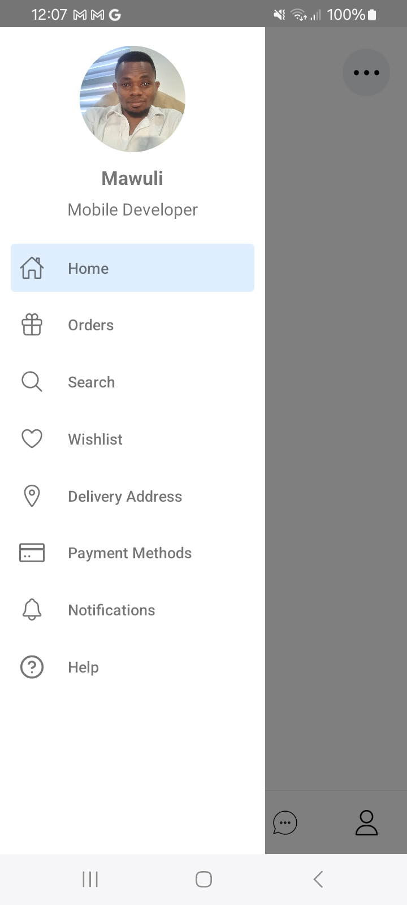

This is a new [**React Native**](https://reactnative.dev) project, bootstrapped using [`@react-native-community/cli`](https://github.com/react-native-community/cli).

## Description

This project uses the following libries

- react native v0.73
- [stack-navigator](https://reactnavigation.org/docs/stack-navigator/) - (to make transitions between screens)
- [react-navigation/bottom-tabs](https://reactnavigation.org/docs/bottom-tab-navigator/) - (simple tab bar on the bottom to switch screens)
- [react-navigation/drawer](https://reactnavigation.org/docs/drawer-based-navigation/) - (common left drawer navigation)
- [react-native-reanimated](https://docs.swmansion.com/react-native-reanimated/) - (to make transitions between screens)
- [react-native-screen/context](https://reactnativeelements.com/)
- [react-native-vector-icons](https://github.com/oblador/react-native-vector-icons)

### For Android

```bash
# using npm
npm run android

# OR using Yarn
yarn android
```

### For iOS

```bash
# using npm
npm run ios

# OR using Yarn
yarn ios
```

## Project Features

- React Navigation
- Drawer Navigation
- Bottom Navigation

## Screens

 | |

<br>

## Feel free to fork this repo and add your own twist.

### More about me

## 👋 You can visit my github here: [Mawuli87](https://github.com/Mawuli87).
